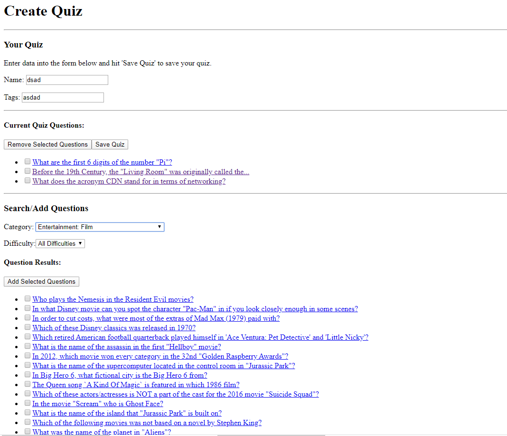

Eric Pham, COMP 2406 - Assignment 4: Trivia Quiz Builder
--------------------------------------------------------

This server utilizes MongoDB to store quizzes and trivia, and allows requests to be made to post quizzes, get questions and get quizzes.

Available Requests:

GET: /questions, /questions/:qID, /createquiz, /quizzes, /quiz/:quizID

POST: /quizzes

Instructions:
- Have mongo daemon on
- Go to directory of files (where server.js is stored) and type these commands:
    - npm install
    - node database-initializer.js
    - node server.js
- To create a quiz, go to localhost:3000/createquiz

Screenshot of quiz creation:

Design choices (other than those specified in assignment specs):
- post /quizzes: request accepts a quiz object of this format (with question object being an object containing at least an _ID key and value):
    - {creator: ____, tags: [___,__,etc.], questions: [{question object},{question object}, etc.]}
- get /questions: supports query parameters:
    - category: will be matched with questions with the exact same category value text
    - difficulty: will be matched with questions with the exact same difficulty value text
- get /quizzes: supports query parameters:
    - creator: will be matched with quizzes by creator names that contain user-given value, case-insensitive
    - tag: will be matched with quizzes with tag that exactly matches user-given value but can be case-insensitive
